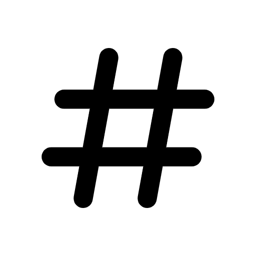
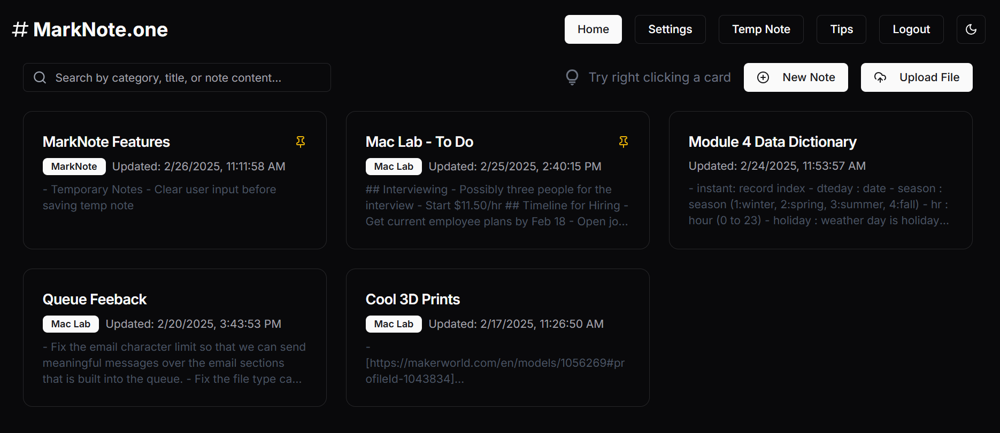

<div align="center">
    <h1>MarkNote.one</h1> 
    
    <p>Welcome to <b>MarkNote.one</b>, a powerful markdown note-taking app with live previews. This app is designed to make note-taking easier and more efficient with a focus on simplicity and functionality.</p>
    <p>
        
        
        
        
        
        
        
    </p>
</div>

## Features

-   **Live Preview**: See your markdown rendered in real-time.
-   **Syntax Highlighting**: Supports the essential markdown syntax.
-   **Cross-Platform**: Available on from [MarkNote.one](https://marknote.one) on any device.
-   **Import & Export**: Easily upload and download you markdown notes.

## Installation

### Prerequisites

-   Node.js (v14.x or above)
-   npm (v6.x or above)

### Steps

1. Clone the repository:
    ```bash
    git clone https://github.com/eglenn-dev/MarkNote.one.git
    ```
2. Navigate to the project directory:
    ```bash
    cd MarkNote.one
    ```
3. Install dependencies:
    ```bash
    npm install
    ```
4. Start the application:
    ```bash
    npm run dev
    ```

## Usage

1. Open the app and start writing your markdown notes.
2. Use the live preview to see changes in real-time.
3. Customize your theme and settings in the preferences menu.
4. Save and export your notes as needed.

## Acknowledgements

While this project is primarily developed by Ethan Glenn, I would like to acknowledge the following resources that have been instrumental in its development:

-   [React](https://react.dev/)
-   [Next.js](https://nextjs.org/)
-   [Tailwind CSS](https://tailwindcss.com/)
-   [shadcn/ui](https://ui.shadcn.com/)



---

Copyright © 2025 [Ethan Glenn](https://eglenn.dev). All rights reserved.
